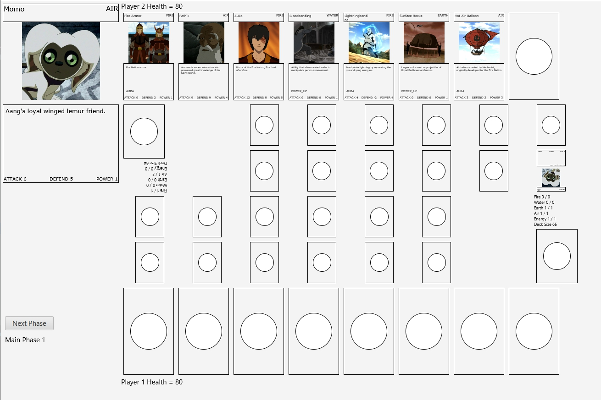

# IF2210 Avatar Duel

This is a game project based of class assignment maintained and developed by a team consists of 5 people.

***Screenshot***

    

***Prerequisites***
---
Java Development Kit 8 and Gradle Build Tools 6.3

***Build and Run***
---
On Windows:
Run command prompt on Avatar-Duel directory and run this command: `gradlew run`

On Linux:
Run command prompt on Avatar-Duel directory and run this command: `./gradlew run`

What happen is when you use `gradlew run` or `./gradlew run`, it will start the main function in this app.
For this app, the main function lives in `AvatarDuel.java`.

## Documentation

Source code can be accessed in the `src` directory. This program is built with several packages which will be explained below:

#### Controller

This package handles the interface and layout of the program. This package consist of these classes: `ArenaController`, `CardHandController`, `CardRender`, `CharacterController`, `CloseCardLayoutController`, `MidFieldController`, `Utility`, and interface `CardLayout`.

#### Games
<<<<<<< HEAD

Games package contains classes that defines and implements game phases. `GameFlow` class controls the game flow, including game state, current player, and also controls the game interface during play time. `State` interface defines destroy skill for each player.

`GameState` is an abstract class for game phases and implements `State` interface. `BattlePhase`, `DrawPhase`, `MainPhase1`, and `EndPhase` inherit `GameState`.
=======
Games package control the game flow. It consist of `BattlePhase`, `DrawPhase`, `EndPhase`, `GameFlow`, `GameState`, `MainPhase1`, `State`

>>>>>>> 51b1a7ca335ed14e82276c6ce6dcae2f4c72d96f
#### Model

Model package builds basic components of the program. This package also has attribute package and type package.

Attribute package consists of these classes:

* `Attribute` defines attack, defense, and power of cards.
* `Deck` defines cards on decks.
* `MidDeck` defines cards being played on middle deck.
* `Power` defines amount of powers from players.
* `RemainingPower` defines remaining amount of powers from players.

Type package consists of these enumerations:

* `Effect`: Aura, Destroy, Power Up
* `Element`: Water, Fire, Air, Earth, Energy

`Card` is an abstract parent class for cards. 
This class has `name`, `element`, and `description` as attributes and can be modified with getter and setter. `Character`, `Land`, and `Skill` inherit `Card`. Character has additional `attribute` attribute, and `Skill` has additional `effect` and `attribute` attributes.

`Player` defines player's stats, including hand cards, middle deck cards, power, and health.

#### Reader

This package consist of card readers. `CardReader` is an abstract class that defines the path to the data resources. `CharacterReader`, `LandReader`, and `SkillReader` inherit `CardReader` and load data from data resources into program.

#### Util

This package contains `CSVReader`. This class reads data from .csv file and used in classes in reader package to load file.

#### Data Resources

Data resources including character cards, land cards, skill cards, and FXML layouts for interface can be found in `resources` directory.

## Credit

All images and description are taken from [Avatar Wikia](https://avatar.fandom.com/wiki/Avatar_Wiki)
